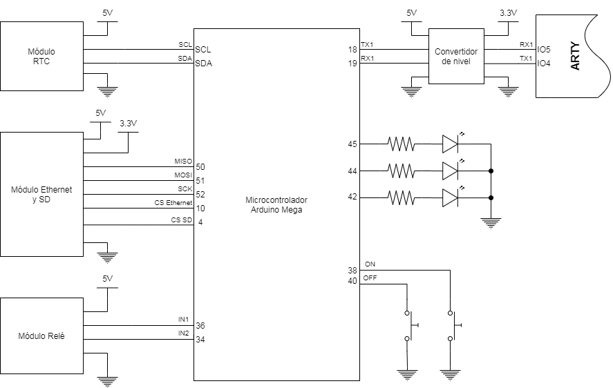

# TDR - Arduino Modbus

## Descripción general

Este repositorio almacena el código del sistema TDR.

## Características

## Hardware

El sistema TDR Utiliza el siguiente Hardware:
- 1 x Arduino Mega 2560
- 1 x Modulo Arduino Ethernet Shield (Wiznet W5100)
- 1 x Modulo RTC DS3231
- 1 x Modulo de 2 relé
- 1 x ARTY
- 1 x Placa Lectura GMS
- 1 x Regulador de voltaje Step Down LM2596
- 1 x Level Converter
- 2 x Botón Táctil
- 3 x Led y resistor

El diagrama de conexiones se puede ver en la siguiente figura:

## Pruebas mediante USB

Existen distintos mensajes que se pueden enviar por el Serial 0 (USB) para probar el sistema. Estos se describen en la tabla a continuación:

| Mensaje    | Acción                    |
|------------|---------------------------|
| RTC        | Simula un request del RTC |
| LeerCables | Lee todos los cables      |
| reset      | Reinicia el sistema       |
| alarmaON   | Prende la alarma          |
| alarmaOFF  | Apaga la alarma           |
| cable1     | Lee el cable 1            |
| cable2     | Lee el cable 2            |
| cable3     | Lee el cable 3            |
| cable4     | Lee el cable 4            |
| cable5     | Lee el cable 5            |
| guardarSD  | Guarda variables en SD    |

## Registros

El sistema TDR se comunica con un servidor mediante holding registers en Modbus. Para ello se dividieron los registros en variables (registros entre 1 a 100), control de acciones (101 a 150) y datos del cable (dependiendo de como se programe en el archivo principal). En la siguiente tabla se detallan los registros utilizados para las variables:

| Registro |   Tipo   | Descripción                           |
|:--------:|:--------:|---------------------------------------|
|     1    | uint16_t | ID Arduino                            |
|     2    |   Bool   | Estado de la alarma                   |
|     3    | uint16_t | Tiempo de muestreo del RTC (segundos) |
|     4    |   Bool   | Modo lectura automática               |
|     5    |     -    | Libre                                 |
|  6 a 10  |   Float  | Estado alarma por cable               |
|  11 a 20 |   Float  | Largo interno                         |
|  21 a 30 |   Float  | Largo Externo                         |
|  31 a 40 |   Float  | Largo nominal                         |
|  41 a 50 |   Float  | Largo Medido                          |
|  51 a 60 |   Float  | umbral alarma cable                   |
|  61 a 70 |   Float  | factor velocidad                      |
|  71 a 75 | uint16_t | Threshold 1                           |
|  76 a 80 | uint16_t | Threshold 2                           |
|  81 a 85 |  Bool    | Hay datos nuevos para leer            |
| 81 a 100 |     -    | Libre                                 |

Los registros para control de acción se describen en la siguiente tabla:

|  Registro | Tipo | Descripción           |
|:---------:|:----:|-----------------------|
|    101    | Bool | Leer todos los cables |
|    102    | Bool | Alarma ON             |
|    103    | Bool | Alarma OFF            |
|    104    | Bool | Reset                 |
|    105    | Bool | Guarda datos en SD    |
| 106 a 110 |   -  | Libre                 |
|    111    | Bool | Leer cable 1          |
|    112    | Bool | Leer cable 2          |
|    113    | Bool | Leer cable 3          |
|    114    | Bool | Leer cable 4          |
|    115    | Bool | Leer cable 5          |

Pamela estubo aqui
